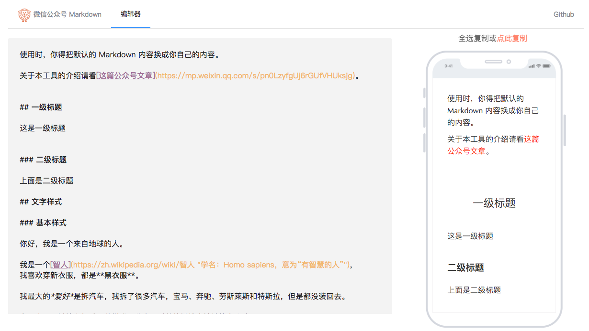

 微信公众号排版编辑器
---



重要备注：本仓库前端是基于该仓库 [lyricat/wechat-format](https://github.com/lyricat/wechat-format) 修改而来。

介绍：将 Markdown 文档内容格式化为符合微信公众号格式的文章内容。

- 在线版：[http://wm.nvwa-io.com](http://wm.nvwa-io.com) （ `wm` 是 Wechat Markdown 的缩写） 
- 介绍：https://mp.weixin.qq.com/s/pn0LzyfgUj6rGUfVHUksjg


## 优点

- 能较好地将 Markdown 排版，并格式化为符合微信公众号的文本可是。
- 解决 `ul` 和 `ol` 元素样式渲染时被微信编辑器重置的问题。
- 文中链接自动转换为参考文献索引，并且附在文字末尾。
- [新] 左侧编辑器编辑内容，右侧实时查看文章样式。


```
# 疑问解答

1. 为什么不基于原仓库(lyricat/wechat-format)进行修改和提 PR ？

原因 1：页面结构修改的变化比较大，跟原项目的所期结构不一致。
原因 2：该项目后续期望加上服务端功能，记录写过的 Markdown 文章，方便继续查看和修改原来编辑过的 Markdown 文档。

2. 为什么要做相应的修改和功能新增？

原因：因为本人时常用 Markdown 写日记或者公众号文章，lyricat/wechat-format 这个项目很好地解决了 Markdown 转公众号文章格式。

基于它，本人后续期望进一步改造和功能扩展，以期实现更符合部分用户使用习惯的用户体验效果。

```
